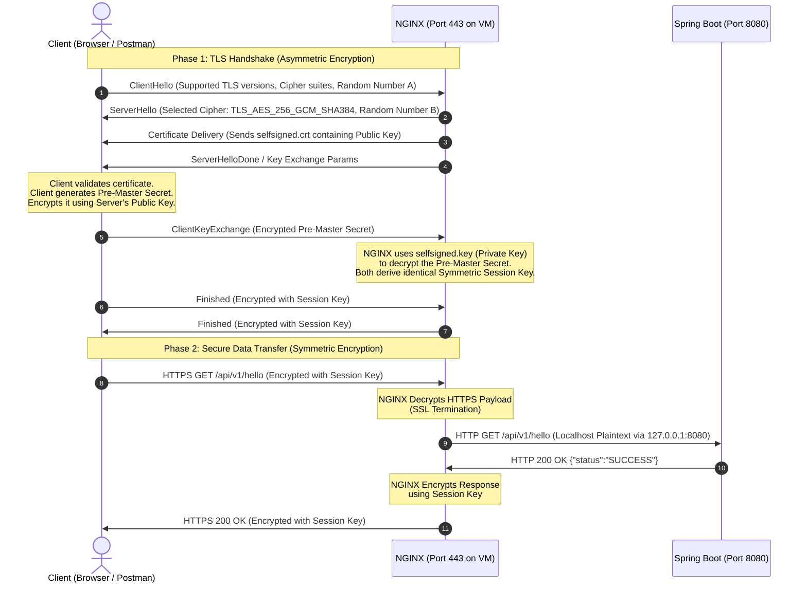

# 🚀 DevOps Deployment, Architecture & Internal TLS/SSL Guide

**Project Repository**: `chandbasha304/devops-java-app`  
**Application Stack**: Java 17, Spring Boot 3.2.3, Docker, NGINX, Google Cloud Platform (Cloud Build, Cloud Run, Compute Engine)  
**Author**: DevOps Engineering Team  

---

## 📑 Table of Contents
1. [Executive Summary & High-Level Architecture](#1-executive-summary--high-level-architecture)
2. [Dual Deployment Models: Cloud Run vs. Compute Engine VM](#2-dual-deployment-models-cloud-run-vs-compute-engine-vm)
3. [Deep Dive: How TLS/SSL Works Internally in This Setup](#3-deep-dive-how-tlsssl-works-internally-in-this-setup)
   - [3.1 Cryptographic Foundation: Asymmetric vs. Symmetric](#31-cryptographic-foundation-asymmetric-vs-symmetric)
   - [3.2 The TLS 1.2/1.3 Handshake (Step-by-Step)](#32-the-tls-1213-handshake-step-by-step)
   - [3.3 SSL Termination & NGINX Reverse Proxy Mechanism](#33-ssl-termination--nginx-reverse-proxy-mechanism)
4. [Step-by-Step Implementation Record](#4-step-by-step-implementation-record)
   - [4.1 Containerization (`Dockerfile` & Spring Boot)](#41-containerization-dockerfile--spring-boot)
   - [4.2 CI/CD Pipeline (`cloudbuild.yaml`)](#42-cicd-pipeline-cloudbuildyaml)
   - [4.3 Compute Engine VM & Firewall Setup](#43-compute-engine-vm--firewall-setup)
   - [4.4 Manual TLS/SSL Certificate Generation & NGINX Configuration](#44-manual-tlsssl-certificate-generation--nginx-configuration)
5. [Vertical Scaling: Deep Dive & Operations](#5-vertical-scaling-deep-dive--operations)
6. [Verification, Testing & Diagnostics](#6-verification-testing--diagnostics)

---

## 1. Executive Summary & High-Level Architecture

This document details the complete end-to-end deployment lifecycle of a containerized Java Spring Boot microservice on Google Cloud Platform (GCP), with enterprise-grade Transport Layer Security (TLS/SSL).

```
                      ┌────────────────────────────────────────────────────────┐
                      │                 DEVELOPER WORKSPACE                    │
                      │  Git Commit & Push -> chandbasha304/devops-java-app    │
                      └───────────────────────────┬────────────────────────────┘
                                                  │
                                                  ▼
                      ┌────────────────────────────────────────────────────────┐
                      │              GOOGLE CLOUD BUILD (CI/CD)                │
                      │  • Step 1: Maven Test & Compile                        │
                      │  • Step 2: Multi-stage Docker Build                    │
                      │  • Step 3: Push Image to Google Artifact Registry      │
                      └───────────────────────────┬────────────────────────────┘
                                                  │
                                                  ▼
                      ┌────────────────────────────────────────────────────────┐
                      │          GOOGLE ARTIFACT REGISTRY (STORAGE)            │
                      │  us-central1-docker.pkg.dev/.../devops-java-app:latest  │
                      └───────────────────────────┬────────────────────────────┘
                                                  │
                         ┌────────────────────────┴────────────────────────┐
                         │                                                 │
                         ▼                                                 ▼
        ┌──────────────────────────────────┐             ┌──────────────────────────────────┐
        │       OPTION 1: CLOUD RUN        │             │        OPTION 2: GCE VM          │
        │       (Serverless Compute)       │             │       (Dedicated IaaS)           │
        │ • Auto-scaling (0 to N)          │             │ • Instance: devops-vm            │
        │ • Google-managed TLS (GFE edge)  │             │ • Machine: e2-standard-2 (2vCPU) │
        │ • Port 8080 container routing    │             │ • NGINX TLS Reverse Proxy        │
        └──────────────────────────────────┘             └──────────────────────────────────┘
```

---

## 2. Dual Deployment Models: Cloud Run vs. Compute Engine VM

| Feature / Metric | Google Cloud Run (Serverless) | Google Compute Engine VM (IaaS) |
| :--- | :--- | :--- |
| **Compute Model** | Fully managed, serverless container runtime | Dedicated Linux Virtual Machine (Ubuntu 22.04 LTS) |
| **Scaling Type** | **Horizontal Auto-scaling** (Spins 0 &rarr; 100+ instances on request load) | **Vertical Scaling** (Upgrades CPU/RAM: 2 vCPU &rarr; 4 vCPU &rarr; 8 vCPU) |
| **TLS/SSL Management** | **Google Frontend (GFE)** manages SSL certs automatically | **Manual / Self-Managed** via OpenSSL or Let's Encrypt (Certbot) |
| **Cost Profile** | Pay-per-request (charges 0 when idle) | Billed per hour VM is running |
| **Control Level** | High abstraction (Container only) | Full OS root access (Kernel, NGINX, Docker, Systemd) |
| **Best Used For** | Microservices, REST APIs, bursty traffic | Monoliths, stateful apps, custom networking/VPN, legacy systems |

---

## 3. Deep Dive: How TLS/SSL Works Internally in This Setup

### 3.1 Cryptographic Foundation: Asymmetric vs. Symmetric

Transport Layer Security (TLS) uses a **hybrid cryptographic system** to achieve both security and maximum performance:

1. **Asymmetric Cryptography (Public-Key Cryptography)**:
   - **Used during**: The TLS Handshake (Initial negotiation).
   - **Key Pair**:
     - `selfsigned.key` (**Private Key**): Stored securely in `/etc/nginx/ssl/` with `600` permissions. **Never shared**.
     - `selfsigned.crt` (**Public Certificate**): Sent to any client (browser/Postman) that connects.
   - **Purpose**: Authenticates the server identity and securely exchanges a shared secret key over an untrusted network.

2. **Symmetric Cryptography (Shared Secret Encryption)**:
   - **Used during**: Data transfer (HTTP payload).
   - **Algorithm**: High-speed ciphers like `AES-256-GCM` or `ChaCha20-Poly1305`.
   - **Purpose**: Fast, low-latency encryption of the actual HTTP requests and JSON responses.

---

### 3.2 The TLS 1.2/1.3 Handshake (Step-by-Step)



---

### 3.3 SSL Termination & NGINX Reverse Proxy Mechanism

In our architecture, **SSL Termination** occurs at the NGINX layer:

```
[ Public Internet ]
        │  HTTPS (Port 443)  <-- Fully Encrypted with TLS 1.2/1.3
        ▼
┌─────────────────────────────────────────────────────────┐
│ NGINX Web Server (/etc/nginx/sites-available/default)   │
│                                                         │
│  1. Performs TLS Handshake with Client                  │
│  2. Decrypts incoming encrypted packets                 │
│  3. Strips TLS layer & injects headers:                 │
│       • Host: $host                                     │
│       • X-Real-IP: $remote_addr                         │
│       • X-Forwarded-For: $proxy_add_x_forwarded_for     │
│       • X-Forwarded-Proto: https                        │
│  4. Forwards plaintext HTTP request internally to:      │
│       http://127.0.0.1:8080                             │
└───────────────────────────┬─────────────────────────────┘
                            │  HTTP (Port 8080)  <-- Internal loopback
                            ▼
┌─────────────────────────────────────────────────────────┐
│ Spring Boot Microservice (Docker Container)             │
│                                                         │
│  • Reads request from loopback (0.0.0.0:8080)           │
│  • Executes Business Logic & JPA Database operations    │
│  • Returns raw JSON HTTP response back to NGINX         │
└─────────────────────────────────────────────────────────┘
```

#### Why SSL Termination at NGINX is an Industry Best Practice:
1. **Performance**: NGINX is written in C and handles SSL handshakes, session caching, and cipher negotiation 5–10x faster than JVM-based TLS.
2. **Security Isolation**: The Java process does not require root privileges (which are otherwise needed to bind to privileged ports `80` and `443`).
3. **Zero JVM Keystore Complexity**: Java applications do not need complex `.p12` or `.jks` keystores bundled into the JAR.
4. **Unified Traffic Control**: HTTP traffic on port `80` is automatically redirected to HTTPS on port `443` with an HTTP `301 Moved Permanently` status code.

---

## 4. Step-by-Step Implementation Record

### 4.1 Containerization (`Dockerfile` & Spring Boot)

Our `Dockerfile` employs a **multi-stage build**:
* **Stage 1 (Builder)**: Uses `maven:3.9.6-eclipse-temurin-17` to compile and package `devops-java-app-1.0.0.jar`.
* **Stage 2 (Runtime)**: Uses lightweight `eclipse-temurin:17-jre-alpine` running as a non-root user (`USER appuser`) with JVM container optimization flags:
  `-XX:+UseContainerSupport -XX:MaxRAMPercentage=75.0`.

`application.properties` binds dynamically:
```properties
server.port=${PORT:8080}
server.address=0.0.0.0
spring.application.name=devops-java-app
```

---

### 4.2 CI/CD Pipeline (`cloudbuild.yaml`)

Automated pipeline steps executed in Google Cloud Build:
1. **Maven Unit Testing**: Executes `mvn clean test`.
2. **Docker Build**: Builds and tags container with `$BUILD_ID` and `latest`.
3. **Artifact Registry Push**: Pushes image to `us-central1-docker.pkg.dev/$PROJECT_ID/devops-repo/devops-java-app`.
4. **Cloud Run Deploy**: Runs `gcloud run deploy` with `--memory 1Gi` and `--cpu-boost`.

---

### 4.3 Compute Engine VM & Firewall Setup

1. **VM Provisioned**:
   * **Name**: `devops-vm`
   * **Zone**: `us-central1-a`
   * **Machine Type**: `e2-standard-2` (2 vCPUs, 8 GB RAM, balanced persistent disk)
   * **Public IP**: `136.64.138.242`
   * **Network Tags**: `http-server`, `https-server`

2. **Firewall Rules Applied**:
   * `allow-http-80`: `tcp:80` (Ingress)
   * `allow-https-443`: `tcp:443` (Ingress)
   * `default-allow-ssh`: `tcp:22` (Ingress)

---

### 4.4 Manual TLS/SSL Certificate Generation & NGINX Configuration

Executed directly on the VM terminal:

```bash
# 1. Install Docker, NGINX, OpenSSL
sudo apt-get update && sudo apt-get install -y docker.io nginx openssl
sudo systemctl enable --now docker nginx

# 2. Authenticate Docker with Google Artifact Registry
gcloud auth configure-docker us-central1-docker.pkg.dev --quiet

# 3. Pull & Run Java Container
sudo docker run -d --name devops-app --restart always -p 8080:8080 \
  us-central1-docker.pkg.dev/project-4505aea2-d22a-474f-ad8/devops-repo/devops-java-app:latest

# 4. Generate 2048-bit RSA Self-Signed Certificate
sudo mkdir -p /etc/nginx/ssl
sudo openssl req -x509 -nodes -days 365 -newkey rsa:2048 \
  -keyout /etc/nginx/ssl/selfsigned.key \
  -out /etc/nginx/ssl/selfsigned.crt \
  -subj "/C=US/ST=State/L=City/O=DevOps/CN=136.64.138.242"

# 5. Configure NGINX Reverse Proxy
sudo tee /etc/nginx/sites-available/default > /dev/null <<'EOF'
server {
    listen 80;
    server_name _;
    return 301 https://$host$request_uri;
}

server {
    listen 443 ssl;
    server_name _;

    ssl_certificate /etc/nginx/ssl/selfsigned.crt;
    ssl_certificate_key /etc/nginx/ssl/selfsigned.key;

    ssl_protocols TLSv1.2 TLSv1.3;
    ssl_ciphers HIGH:!aNULL:!MD5;

    location / {
        proxy_pass http://127.0.0.1:8080;
        proxy_set_header Host $host;
        proxy_set_header X-Real-IP $remote_addr;
        proxy_set_header X-Forwarded-For $proxy_add_x_forwarded_for;
        proxy_set_header X-Forwarded-Proto https;
    }
}
EOF

# 6. Test & Reload NGINX
sudo nginx -t
sudo systemctl restart nginx
```

---

## 5. Vertical Scaling: Deep Dive & Operations

### What is Vertical Scaling?
Vertical scaling (Scaling Up / Down) involves increasing or decreasing the **hardware specifications (vCPUs and RAM)** of an existing virtual machine without re-architecting the code or migrating data.

```
                 VERTICAL SCALING UP (Scale-Up)
┌──────────────────────┐         ┌──────────────────────┐
│    e2-standard-2     │  ───►   │    e2-standard-4     │
│  2 vCPUs, 8 GB RAM   │         │  4 vCPUs, 16 GB RAM  │
└──────────────────────┘         └──────────────────────┘
 (Persistent Boot Disk with all files, Docker, SSL certs remains 100% intact)
```

### Why Compute Engine Persistent Disks Make This Safe
In Google Cloud, compute (CPU/RAM) is completely decoupled from storage (Persistent Disk). When you stop an instance to resize its machine type:
* The disk state, NGINX configurations, SSL keys, and Docker images are **preserved identically**.
* When powered back on, Systemd automatically starts Docker, starts the `devops-app` container (`--restart always`), and starts NGINX without manual intervention.

### Vertical Scaling Commands

```powershell
# Step 1: Stop the VM
gcloud compute instances stop devops-vm --zone=us-central1-a

# Step 2: Scale up to 4 vCPUs / 16 GB RAM
gcloud compute instances set-machine-type devops-vm --zone=us-central1-a --machine-type=e2-standard-4

# Step 3: Start the VM
gcloud compute instances start devops-vm --zone=us-central1-a
```

To scale to custom sizes (e.g. 8 vCPUs, 32 GB RAM):
```powershell
gcloud compute instances set-machine-type devops-vm --zone=us-central1-a --machine-type=e2-standard-8
```

---

## 6. Verification, Testing & Diagnostics

### 6.1 Inspecting the TLS Handshake via CLI
Run `curl` with verbose output to observe the exact cipher negotiation and certificate exchange:

```bash
curl -k -v https://136.64.138.242/api/v1/hello
```

**Sample Output Explaining the Handshake**:
```text
* Connected to 136.64.138.242 (136.64.138.242) port 443
* ALPN: curl offers h2,http/1.1
* TLSv1.3 (OUT), TLS handshake, Client hello (1):
* TLSv1.3 (IN), TLS handshake, Server hello (2):
* TLSv1.3 (IN), TLS handshake, Encrypted Extensions (8):
* TLSv1.3 (IN), TLS handshake, Certificate (11):
* TLSv1.3 (IN), TLS handshake, CERT verify (15):
* TLSv1.3 (IN), TLS handshake, Finished (20):
* SSL connection using TLSv1.3 / TLS_AES_256_GCM_SHA384
> GET /api/v1/hello HTTP/1.1
> Host: 136.64.138.242
< HTTP/1.1 200 OK
< Content-Type: application/json
{"status":"SUCCESS","message":"Welcome to the Unified DevOps API on Cloud Run!"}
```

---

### 6.2 Postman Test Suite

| Method | Endpoint | Description |
| :--- | :--- | :--- |
| `GET` | `https://136.64.138.242/api/v1/hello` | API health and greeting check |
| `GET` | `https://136.64.138.242/api/v1/tasks` | Fetch all deployment tasks from H2 database |
| `POST` | `https://136.64.138.242/api/v1/tasks` | Create a new deployment record |
| `GET` | `https://136.64.138.242/api/v1/tasks/stats` | Retrieve real-time deployment metrics |
| `GET` | `https://136.64.138.242/actuator/health` | Spring Boot Actuator health probe |

*(In Postman Settings, ensure **"SSL certificate verification"** is toggled OFF when testing self-signed certificates).*

---

### 6.3 Operational Diagnostics Commands

```bash
# Check Docker container status and logs
sudo docker ps
sudo docker logs -f devops-app

# Check NGINX status and error logs
sudo systemctl status nginx
sudo tail -f /var/log/nginx/error.log
sudo tail -f /var/log/nginx/access.log

# Check system memory & CPU load
htop
```

---

*Document finalized and archived in workspace repository: `ARCHITECTURE_AND_SSL_GUIDE.md`.*
