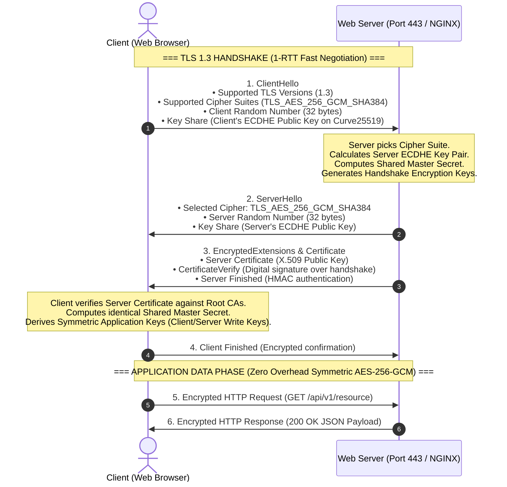

# 🔒 Comprehensive TLS/SSL Master Engineering Guide: From Theory to VM Implementation

---

## 📑 Table of Contents
1. [HTTP vs. HTTPS: The Architectural & Security Paradigm](#1-http-vs-https-the-architectural--security-paradigm)
2. [Cryptographic Foundations](#2-cryptographic-foundations)
   - [2.1 Asymmetric Cryptography & The RSA-2048 Algorithm](#21-asymmetric-cryptography--the-rsa-2048-algorithm)
   - [2.2 Symmetric Cryptography (AES-256-GCM & ChaCha20)](#22-symmetric-cryptography-aes-256-gcm--chacha20)
   - [2.3 Diffie-Hellman & Perfect Forward Secrecy (PFS)](#23-diffie-hellman--perfect-forward-secrecy-pfs)
   - [2.4 Cryptographic Hashing & Message Authentication (SHA-256 / HMAC)](#24-cryptographic-hashing--message-authentication-sha-256--hmac)
3. [File Formats & Extensions Decoded (`.key`, `.csr`, `.crt`, `.pem`, `.der`, `.p12`)](#3-file-formats--extensions-decoded-key-csr-crt-pem-der-p12)
4. [Anatomy of an X.509 Public Key Certificate](#4-anatomy-of-an-x509-public-key-certificate)
5. [Pin-to-Point TLS Handshake Mechanics (TLS 1.2 vs. TLS 1.3)](#5-pin-to-point-tls-handshake-mechanics-tls-12-vs-tls-13)
6. [Step-by-Step VM Implementation: Generating Certificates with OpenSSL](#6-step-by-step-vm-implementation-generating-certificates-with-openssl)
7. [Enterprise NGINX Web Server Configuration & SSL Termination](#7-enterprise-nginx-web-server-configuration--ssl-termination)
8. [Automatic HTTP to HTTPS Redirection (Port 80 &rarr; 443)](#8-automatic-http-to-https-redirection-port-80--443)
9. [Let's Encrypt / Certbot Automated Production Setup](#9-lets-encrypt--certbot-automated-production-setup)
10. [Diagnostics, CLI Testing & Verification (`openssl s_client` / `curl`)](#10-diagnostics-cli-testing--verification-openssl-s_client--curl)

---

## 1. HTTP vs. HTTPS: The Architectural & Security Paradigm

```
┌─────────────────────────────────────────────────────────────────────────────┐
│                             HTTP (UNENCRYPTED)                              │
│                                                                             │
│   Client ────────────────── Plaintext TCP Packets ──────────────────► Server│
│   (Browser)             GET /login?user=admin&pass=123              (Port 80)│
│                                                                             │
│   ⚠️ Vulnerabilities: Eavesdropping, Man-in-the-Middle (MITM), Tampering    │
└─────────────────────────────────────────────────────────────────────────────┘

┌─────────────────────────────────────────────────────────────────────────────┐
│                           HTTPS (TLS 1.2 / TLS 1.3)                         │
│                                                                             │
│   Client ───────────── TLS Encrypted Binary Records ───────────────► Server│
│   (Browser)            Ciphertext: 7f 3a b9 02 e4 c1...            (Port 443)│
│                                                                             │
│   🛡️ Guarantees: Confidentiality, Integrity, Identity Authentication        │
└─────────────────────────────────────────────────────────────────────────────┘
```

### The Three Core Security Pillars of TLS
1. **Confidentiality (Privacy)**: No third-party network sniffer (ISP, public Wi-Fi, malicious router) can read the HTTP headers, URLs, cookies, or body data.
2. **Integrity (Tamper-Proof)**: Cryptographic Message Authentication Codes (MAC / AEAD) ensure that data cannot be altered or injected in transit without detection.
3. **Authentication (Identity Verification)**: The client verifies that the server truly owns the domain name and possesses the corresponding private key signed by a trusted Certificate Authority (CA).

---

## 2. Cryptographic Foundations

TLS uses a **hybrid cryptographic architecture**: asymmetric cryptography for authentication and key exchange, followed by symmetric cryptography for high-speed bulk data transfer.

```
                  ┌─────────────────────────────────────────┐
                  │          TLS HYBRID CRYPTOGRAPHY        │
                  └────────────────────┬────────────────────┘
                                       │
            ┌──────────────────────────┴──────────────────────────┐
            ▼                                                     ▼
┌───────────────────────────────┐             ┌───────────────────────────────┐
│     ASYMMETRIC ENCRYPTION     │             │     SYMMETRIC ENCRYPTION      │
│  (Used during TLS Handshake)  │             │   (Used for Data Transfer)    │
│ • Algorithms: RSA-2048, ECDSA │             │ • Algorithms: AES-256-GCM     │
│ • Public Key: Encrypt/Verify  │             │ • Single Shared Session Key   │
│ • Private Key: Decrypt/Sign   │             │ • Extremely fast (hardware)   │
└───────────────────────────────┘             └───────────────────────────────┘
```

---

### 2.1 Asymmetric Cryptography & The RSA-2048 Algorithm

**RSA (Rivest–Shamir–Adleman)** relies on the mathematical difficulty of factoring the product of two massive prime numbers.

#### The Mathematical Engine Behind RSA-2048:
1. **Prime Generation**: Select two distinct, massive prime numbers $p$ and $q$ (each 1024 bits long).
2. **Compute Modulus ($n$)**:
   $$n = p \times q$$
   The modulus $n$ is 2048 bits long (approx. 617 decimal digits) and forms part of both the Public Key and the Private Key.
3. **Compute Euler's Totient ($\phi(n)$)**:
   $$\phi(n) = (p - 1)(q - 1)$$
4. **Choose Public Exponent ($e$)**:
   Typically chosen as $e = 65537$ ($2^{16} + 1$, known as Fermat prime $F_4$), which allows fast binary modular exponentiation.
5. **Compute Private Exponent ($d$)**:
   $$d \equiv e^{-1} \pmod{\phi(n)} \quad \implies \quad (d \times e) \equiv 1 \pmod{\phi(n)}$$
6. **The Key Pair**:
   * **Public Key**: $(e, n)$ &rarr; Embedded in `.crt` / `.pem` certificate and distributed to the world.
   * **Private Key**: $(d, n)$ &rarr; Stored in `.key` file with `chmod 600` permissions. **Never leaves the VM**.

#### Encryption & Decryption Formula:
* **To Encrypt a Message ($M$) with Public Key**:
  $$C = M^e \pmod{n}$$
* **To Decrypt Ciphertext ($C$) with Private Key**:
  $$M = C^d \pmod{n}$$

---

### 2.2 Symmetric Cryptography (AES-256-GCM & ChaCha20)

Once the handshake establishes a shared secret, asymmetric math is discarded because it is CPU-intensive. The connection switches to **Authenticated Encryption with Associated Data (AEAD)**:

* **AES-256-GCM (Galois/Counter Mode)**:
  * Uses a 256-bit symmetric key.
  * Encrypts plaintext in 128-bit blocks using counter mode.
  * Generates an authentication tag (GMAC) simultaneously to guarantee data integrity.
  * Accelerated by CPU hardware instructions (`AES-NI`).
* **ChaCha20-Poly1305**:
  * Stream cipher paired with Poly1305 authenticator.
  * Extremely fast on devices without hardware AES acceleration (ARM/mobile).

---

### 2.3 Diffie-Hellman & Perfect Forward Secrecy (PFS)

Modern TLS (TLS 1.2 & TLS 1.3) mandates **Ephemeral Elliptic-Curve Diffie-Hellman (ECDHE)**:

* **How it works**: For every new connection, the client and server generate temporary (ephemeral) key pairs, compute a shared secret over an elliptic curve (e.g., `X25519` or `secp256r1`), and immediately discard the ephemeral private keys.
* **Why Perfect Forward Secrecy matters**: Even if an attacker records all encrypted traffic today and steals the server's RSA private key 5 years from now, **they still cannot decrypt past recorded sessions**.

---

### 2.4 Cryptographic Hashing & Message Authentication (SHA-256 / HMAC)

* **SHA-256 (Secure Hash Algorithm 256-bit)**: Produces a deterministic 32-byte hash from input data of any size.
* **Digital Signatures**: To prove a certificate was issued by a Certificate Authority (CA):
  1. The CA hashes the certificate details with SHA-256: $H = \text{SHA-256}(\text{Certificate Data})$.
  2. The CA encrypts $H$ with its private key: $\text{Signature} = H^{d_{\text{CA}}} \pmod{n_{\text{CA}}}$.
  3. Clients decrypt the signature using the CA's built-in public key to verify that $H_{\text{computed}} == H_{\text{decrypted}}$.

---

## 3. File Formats & Extensions Decoded (`.key`, `.csr`, `.crt`, `.pem`, `.der`, `.p12`)

| Extension | Format Name | Encoding | Contains | Typical Usage |
| :--- | :--- | :--- | :--- | :--- |
| **`.key`** | Private Key | ASCII (PEM) or Binary (DER) | RSA or ECC Private Key | Kept secret on the server (`/etc/nginx/ssl/server.key`) |
| **`.csr`** | Certificate Signing Request | ASCII (Base64 PEM) | Public Key + Organization Details | Sent to a Certificate Authority (CA) to get signed |
| **`.crt` / `.cer`** | Certificate | ASCII (PEM) or Binary (DER) | Public Key, Subject, Issuer, Signature | Public certificate given to web browsers |
| **`.pem`** | Privacy Enhanced Mail | ASCII (Base64 with headers) | Private Key, Certificate, or Full Chain | Standard Linux format (`-----BEGIN CERTIFICATE-----`) |
| **`.der`** | Distinguished Encoding Rules | Binary (Raw ASN.1) | Private Key or Certificate | Java / Windows binary formats |
| **`.p12` / `.pfx`** | PKCS#12 | Binary (Password Protected) | Bundled Private Key + Certificate Chain | Java Keystores, Windows IIS, client auth |

---

## 4. Anatomy of an X.509 Public Key Certificate

An X.509 certificate is a standardized digital identity card structured in **ASN.1 (Abstract Syntax Notation One)**:

```
Certificate:
    Data:
        Version: 3 (0x2)
        Serial Number: 4a:2b:89:1f:0c... (Unique ID from CA)
        Signature Algorithm: sha256WithRSAEncryption
        Issuer: C=US, O=Let's Encrypt, CN=R3 (Who signed it)
        Validity:
            Not Before: Sep  3 06:00:00 2026 GMT
            Not After : Dec  2 06:00:00 2026 GMT (90-day expiry)
        Subject: CN=api.yourdomain.com (Who owns it)
        Subject Public Key Info:
            Public Key Algorithm: rsaEncryption
                RSA Public-Key: (2048 bit)
                Modulus: 00:c4:9e:31:f7...
                Exponent: 65537 (0x10001)
        X509v3 extensions:
            X509v3 Subject Alternative Name (SAN):
                DNS:api.yourdomain.com, DNS:www.yourdomain.com, IP:136.64.138.242
            X509v3 Key Usage: Digital Signature, Key Encipherment
            X509v3 Basic Constraints: CA:FALSE (Cannot sign other certs)
    Signature Algorithm: sha256WithRSAEncryption
        a8:3f:7b:19:2e:51:... (CA Digital Signature)
```

---

## 5. Pin-to-Point TLS Handshake Mechanics (TLS 1.2 vs. TLS 1.3)



---

## 6. Step-by-Step VM Implementation: Generating Certificates with OpenSSL

### The Single OpenSSL Command:
```bash
sudo mkdir -p /etc/nginx/ssl
sudo openssl req -x509 -nodes -days 365 -newkey rsa:2048 \
  -keyout /etc/nginx/ssl/selfsigned.key \
  -out /etc/nginx/ssl/selfsigned.crt \
  -subj "/C=US/ST=California/L=SanFrancisco/O=DevOpsCorp/OU=IT/CN=136.64.138.242"
```

### Parameter-by-Parameter Breakdown:

| Flag | Meaning | Deep Technical Purpose |
| :--- | :--- | :--- |
| `req` | Certificate Request | Uses the PKCS#10 X.509 certificate and signing request management utility. |
| `-x509` | Self-Signed Output | Bypasses the Certificate Signing Request (CSR) stage and outputs a valid, self-signed X.509 certificate directly. |
| `-nodes` | No DES (No Password) | Short for *"No DES"*. Prevents OpenSSL from encrypting the private key with a passphrase. Required so NGINX can start automatically on boot without prompting a human for a password. |
| `-days 365` | Certificate Validity | Sets the certificate expiration timer to 365 days from the generation timestamp. |
| `-newkey rsa:2048` | Generate Key & Algorithm | Creates a new 2048-bit RSA private key simultaneously with the certificate. |
| `-keyout <path>` | Private Key Output File | Directs OpenSSL where to write the generated RSA Private Key (`selfsigned.key`). |
| `-out <path>` | Certificate Output File | Directs OpenSSL where to write the generated Public Certificate (`selfsigned.crt`). |
| `-subj "..."` | Subject Information | Pre-fills the certificate metadata fields without interactive prompts (`CN` = Common Name/IP). |

### Securing Key Permissions on the VM:
```bash
# Ensure only root can read the private key
sudo chmod 600 /etc/nginx/ssl/selfsigned.key
sudo chmod 644 /etc/nginx/ssl/selfsigned.crt
```

---

## 7. Enterprise NGINX Web Server Configuration & SSL Termination

Open the NGINX site configuration:
```bash
sudo nano /etc/nginx/sites-available/default
```

### The Complete Production Configuration:

```nginx
# ==============================================================================
# 1. HTTP Server Block: Automatic Redirect to HTTPS (Port 80 -> 443)
# ==============================================================================
server {
    listen 80 default_server;
    listen [::]:80 default_server;
    server_name _;

    # Permanent 301 Redirect to HTTPS
    return 301 https://$host$request_uri;
}

# ==============================================================================
# 2. HTTPS Server Block: SSL Termination & Reverse Proxy (Port 443)
# ==============================================================================
server {
    listen 443 ssl http2 default_server;
    listen [::]:443 ssl http2 default_server;
    server_name _;

    # --- SSL Certificate & Private Key Paths ---
    ssl_certificate /etc/nginx/ssl/selfsigned.crt;
    ssl_certificate_key /etc/nginx/ssl/selfsigned.key;

    # --- Modern Secure TLS Protocols Only ---
    ssl_protocols TLSv1.2 TLSv1.3;

    # --- High-Security Cipher Suites (PFS & AEAD) ---
    ssl_prefer_server_ciphers on;
    ssl_ciphers 'ECDHE-ECDSA-AES256-GCM-SHA384:ECDHE-RSA-AES256-GCM-SHA384:ECDHE-ECDSA-CHACHA20-POLY1305:ECDHE-RSA-CHACHA20-POLY1305:ECDHE-ECDSA-AES128-GCM-SHA256:ECDHE-RSA-AES128-GCM-SHA256';

    # --- SSL Session Caching for Low Latency ---
    ssl_session_cache shared:SSL:10m;
    ssl_session_timeout 1d;
    ssl_session_tickets off;

    # --- Security Headers ---
    add_header X-Frame-Options "SAMEORIGIN" always;
    add_header X-Content-Type-Options "nosniff" always;
    add_header X-XSS-Protection "1; mode=block" always;
    add_header Strict-Transport-Security "max-age=31536000; includeSubDomains" always;

    # --- Reverse Proxy Routing to Backend Application ---
    location / {
        proxy_pass http://127.0.0.1:8080;
        proxy_http_version 1.1;

        # Standard Proxy Headers to Preserve Client Context
        proxy_set_header Host $host;
        proxy_set_header X-Real-IP $remote_addr;
        proxy_set_header X-Forwarded-For $proxy_add_x_forwarded_for;
        proxy_set_header X-Forwarded-Proto https;
        proxy_set_header X-Forwarded-Port 443;

        # Connection Keep-Alive
        proxy_set_header Connection "";
        proxy_connect_timeout 60s;
        proxy_send_timeout 60s;
        proxy_read_timeout 60s;
    }
}
```

### Apply Configuration:
```bash
# Test syntax validity
sudo nginx -t

# Reload NGINX without downtime
sudo systemctl reload nginx
```

---

## 8. Automatic HTTP to HTTPS Redirection (Port 80 &rarr; 443)

When a client enters `http://136.64.138.242`:

```
1. Client Browser sends unencrypted HTTP request:
   GET /api/v1/hello HTTP/1.1
   Host: 136.64.138.242:80

2. NGINX Port 80 block intercepts and immediately returns HTTP 301:
   HTTP/1.1 301 Moved Permanently
   Location: https://136.64.138.242/api/v1/hello

3. Client Browser upgrades connection and initiates TLS Handshake on Port 443:
   ClientHello (Port 443) -> Complete TLS 1.3 Handshake -> Encrypted HTTP Request
```

---

## 9. Let's Encrypt / Certbot Automated Production Setup

If you attach a registered domain name (e.g., `api.example.com`) to your VM's public IP:

```bash
# 1. Install Certbot and the NGINX plugin
sudo apt update
sudo apt install -y certbot python3-certbot-nginx

# 2. Request Certificate & Automatically Update NGINX
sudo certbot --nginx -d api.example.com -d www.example.com

# 3. Test Automatic Renewal Cron Job (Certbot auto-renews every 60 days)
sudo certbot renew --dry-run
```

Certbot automatically replaces your self-signed certificate with a globally trusted, browser-recognized CA certificate signed by the **Internet Security Research Group (ISRG) Root X1**.

---

## 10. Diagnostics, CLI Testing & Verification (`openssl s_client` / `curl`)

### 10.1 Full Handshake Debugging with OpenSSL
Run this command from any terminal to inspect the raw TLS handshake:

```bash
openssl s_client -connect 136.64.138.242:443 -servername 136.64.138.242
```

**Key Information Revealed**:
* Negotiated Protocol: `TLSv1.3`
* Selected Cipher: `TLS_AES_256_GCM_SHA384`
* Server Certificate Chain & Validity Dates
* Session Resumption Details

---

### 10.2 Inspecting HTTP Response Headers & Redirection
```bash
# Test HTTP 301 Redirect
curl -I http://136.64.138.242/api/v1/hello

# Test HTTPS Endpoint (with -k for self-signed cert)
curl -k -I https://136.64.138.242/api/v1/hello
```

---

## 🎯 Summary Reference Sheet

| Item | Specification in this Setup |
| :--- | :--- |
| **Inbound Ports** | Port 80 (HTTP &rarr; 301 Redirect), Port 443 (HTTPS / TLS 1.2 & 1.3) |
| **Private Key** | `/etc/nginx/ssl/selfsigned.key` (2048-bit RSA, `chmod 600`) |
| **Public Certificate** | `/etc/nginx/ssl/selfsigned.crt` (X.509 SHA-256 with RSA) |
| **SSL Termination** | Terminated at NGINX &rarr; Plaintext forwarded to `127.0.0.1:8080` |
| **Cipher Suites** | ECDHE Key Exchange + AES-256-GCM / ChaCha20-Poly1305 with PFS |

---
